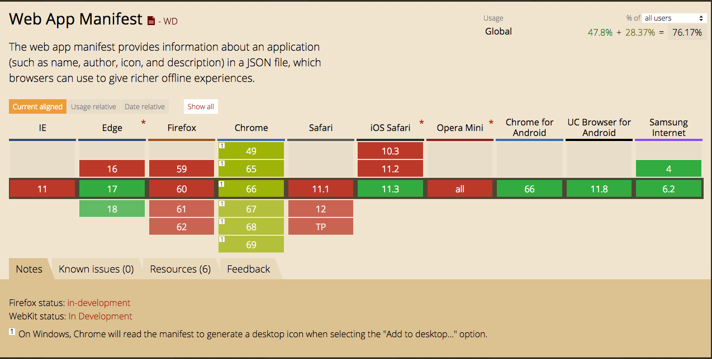
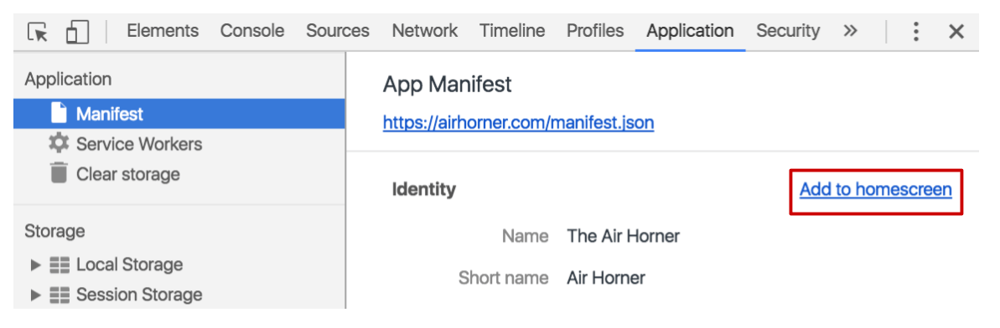
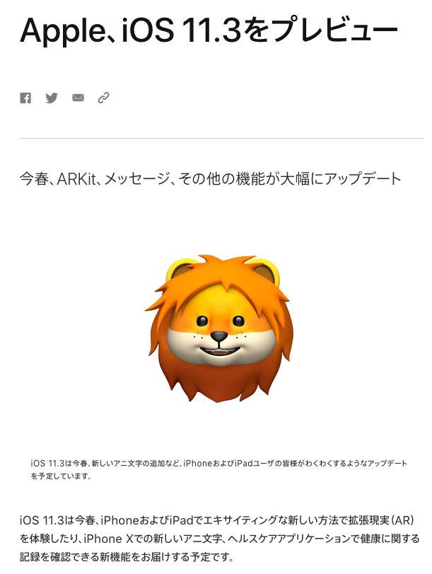

# PWA 入門 〜iOS SafariでPWAを体験するまで〜

## What's PWA ?

Progressive Web Apps （プログレッシブ　ウェブ　アップス）の略。

PWAは、わざわざApple StoreやGoogle Play Storeから**インストールする必要はありません**

**不安定なネットワークでも迅速に起動**し、関連性の高い**プッシュ通知を送信**することができます。

**ホーム画面にアイコンを表示**することができ、トップレベルの全画面表示で読み込むことができます。

▼このように、Webサイトを直接ホームに追加することでアプリケーション化されます


## 導入事例


+ Trivago
https://www.trivago.com


+ Twitter Lite
https://mobile.twitter.com
👉 平均PV65%増、ツイート数75%増🔺
👉 直帰率20%削減⤵︎

+ Wego
https://www.wegotravel.jp/
👉 コンバージョン39%増🔺

+ 楽天レシピ
https://recipe.rakuten.co.jp/
👉 PVが3.1倍に増加🔺
👉 1ヶ月後にプッシュ通知を受け取ったユーザーの訪問数が5.3倍に増加🔺

+ SUUMO
http://suumo.jp
👉 ページの読み込み時間が75%削減⤵︎

+ Alibaba
https://www.alibaba.com
👉 コンバージョン76%増🔺

## Can I use PWA?

Android Chromeはすでに対応済み

iOSは11.3から対応予定

**※iOS11.3を先取りインストールしてiOSでPWAテストする方法は下記に書きます**





## PWA対応させてみる

この3つだけ

1. HTTPS対応
2. manifest.json設置
3. Service Workerを有効にする

### 1. HTTPS対応

SSL証明書の購入が必要で、6千円〜数万円/年程度。

ただし、無料でSSL証明書を発行できる [Let's Encrypt](https://letsencrypt.jp/) というものもあり、さくらサーバーやロリポップと連携してお手軽にHTTPS化できるようになってきています

今回は、割愛するためにすでにHTTPS化されている、Github Pages（github.io）を使います

Github.com にログインし

```
あなたのユーザーネーム.github.io
```

という名前のリポジトリを作り、`index.html` を master branch に push しましょう


```html
<!-- index.html -->
<html>
<head>
  <title>github pages test</title>
</head>
<body>
  <h1>github pages test</h1>
</body>
</html>
```


https://あなたのユーザーネーム.github.io


にアクセスして、「github pages test」と表示されていたらOKです

httpsでアクセス出来ていることに注目してください


### 2. manifest.json設置

index.htmlと同じ階層に manifest.json を作成しましょう

▼manifest.json
```json
{
  "name": "PWA Sample",
  "short_name": "PWA",
  "background_color": "#fc980c",
  "icons": [{
      "src": "./icon-256.png",
      "sizes": "256x256",
      "type": "image/png"
    },{
      "src": "./icon-192.png",
      "sizes": "192x192",
      "type": "image/png"
    }],
  "start_url": "./?utm_source=homescreen",
  "display": "standalone"
}
```

ここで指定するホームスクリーン用アイコンもindex.htmlと同じ階層に配置しましょう

今回はサイズの違う2種類です

[https://umamichi.github.io/pwa-sample/icon-256.png](https://umamichi.github.io/pwa-sample/icon-256.png)

[https://umamichi.github.io/pwa-sample/icon-192.png](https://umamichi.github.io/pwa-sample/icon-192.png)

Googleによると、**192x192のpngアイコン**が登録されていないと、`ホーム画面に追加`バナーが表示されないので注意しましょう


▼ 起動時のURLです。PWAとしてアクセスしたことが分かるように、URLにクエリを付与しています
ここで使用している値は、Google Analytics において意味があるというメリットもあるそうです
```
  "start_url": "./?utm_source=homescreen",
```


▼ display タイプを standalone に設定すると、ウェブアプリでブラウザの UI を非表示にすることができます。
```
  "display": "standalone"
```


### 3. Service Workerを有効にする

Service Workerは、オフライン体験をサポートするために重要です

index.htmlと同じ階層に配置しましょう

```javascript
// service-worker.js
self.addEventListener('install', function(e) {
  console.log('[ServiceWorker] Install');
});

self.addEventListener('activate', function(e) {
  console.log('[ServiceWorker] Activate');
});

self.addEventListener('fetch', function(event) {});
```

### 4. index.html から `manifest.json` `service-worker.js` を呼び出す


index.htmlをこのように変更しましょう
さらに、オフラインでアプリケーションが動作することを明確にするために、2種の画像と `p.html` も追加してみましょう


```html
<!-- index.html -->
<html>
<head>
  <link rel="manifest" href="./manifest.json">
  <script>
    if ('serviceWorker' in navigator) {
      navigator.serviceWorker.register('./service-worker.js').then(function() { console.log('Service Worker Registered'); });
   }
  </script>
  <title>Hello PWA.</title>
  <style>
    body {
      text-align:center;
      font-size: 40px;
      vertical-align: middle;
    }
    .image {
      width: 80%; 
      margin: auto;
      display: block;
    }
  </style>
</head>
<body>
  <h1>Hello PWA.</h1>
  
  <a href="p.html">p.html</a>
</body>
</html>
```

```html
<!-- p.html -->
<html>
<head>
  <title>Hello PWA. p.html</title>
  <style>
    body {
      text-align:center;
      font-size: 40px;
      vertical-align: middle;
    }
    .image {
      width: 80%; 
      margin: auto;
      display: block;
    }
  </style>
</head>
<body>
  <h1>p.html</h1>
  
  <a href="index.html">index.html</a>
</body>
</html>
```

+ 画像1
[https://umamichi.github.io/pwa-sample/pwa-logo.svg](https://umamichi.github.io/pwa-sample/pwa-logo.svg)

+ 画像2
[https://umamichi.github.io/pwa-sample/p-chan.jpg](https://umamichi.github.io/pwa-sample/p-chan.jpg)


すべて、index.htmlと同じ、ルートディレクトリに配置するだけです

あとは、master branch に push しましょう

↓このようなページになればOKです

https://umamichi.github.io/pwa-sample

### 5. PC版Chromeで確認する

PC版Chromeで以下にアクセスし、Developerツールを開きましょう

https://あなたのユーザーネーム.github.io




[Application] パネル -> [Manifest] タブから

`Add to homescreen` をクリックしましょう

PC版ChromeにWebページが、PWAとして追加されるはずです


### 6. Androidで確認する

Androidでアクセスすると、`ホームスクリーンに追加`を促すポップが出現します

ちなみに、Googleによると、出現には以下の条件があります

**> 2 回以上のアクセスがあり、そのアクセスに 5 分以上の間隔がある。**

ホームスクリーンに追加できたら、起動してみましょう

トップレベルの全画面表示でWebページが表示されたはずです


### 7. iOS SafariでPWAを体験する

Appleによると、iOS11.3からPWAをサポートします



現状（2018年3月20日）ではまだ11.3はリリースされていませんが、beta版をインストールして試すことはできます

https://beta.apple.com/sp/betaprogram/

こちらから登録して、iPhoneにインストールしてみましょう

**※iOSアップグレードの前にバックアップをとっておくことをお勧めします**

iOSでは`ホームスクリーンに追加`ポップなど、まだ未実装の部分もありますが、

このようにPWAとして起動することが確認できます👇


### 8. オフラインで動作することの確認 


さきほどホームに追加したPWAを機内モードで起動してみましょう

オフラインでページ遷移、画像の表示がされるはずです

このようにPWAはオフライン環境でもコンテンツの表示が可能です


## PWAとネイティブアプリの比較


| | PWA | ネイティブアプリ |
| -- | -- | -- |
| 速度 | 少し遅め | 早め | 
| インストール | ブラウザからワンタップ | Storeから検索が必要 | 
| 開発コスト | 低 | 高 | 
| リリースのタイミング | developerの任意のタイミング | Store申請＆ユーザーが手動で行う | 
| オフラインで動作 | ○ | ○ | 
| ハードウェアアクセス | △ | ○ | 
| push通知 | ○ | ○ | 
| iOS, Android | ワンソースで完結 | OSごとに開発が必要 | 

PWAの一番大きなメリットは、インストールとStore申請の手間が省かれることです

また、1ソースで複数のプラットフォームに対応でき、開発コストが少なくて済みます

リリースタイミングも通常WEBサイトと同様、開発者の任意のタイミングで行えるので、開発者とユーザー両方にとって良いことばかり🤗


## まとめ&今後

+ ネイティブアプリは徐々にPWAに移行するでしょう

	（iOS11.3が今春リリースされるので、移行はさらに加速されるでしょう）

+ ユーザーにとっても、PWAはインストールレス・アップデートレスなので、ネイティブアプリより好まれるでしょう

+ 高度なグラフィック処理・大量の計算処理が必要なアプリケーションのみ、ネイティブアプリとして残るでしょう


## 参考

https://developers.google.com/web/fundamentals/app-install-banners/?hl=ja
