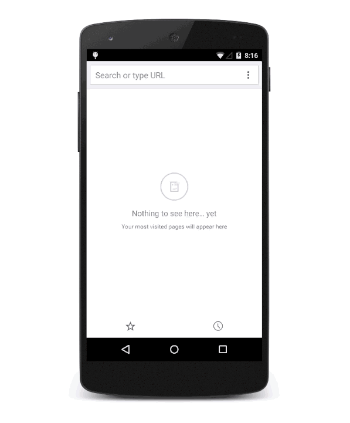

# PWA先取り iOS SafariでPWAを試す

## What's PWA ?

Progressive Web Apps （プログレッシブ　ウェブ　アップス）の略。

PWAは、わざわざApple StoreやGoogle Play Storeから**インストールする必要はありません**

**不安定なネットワークでも迅速に起動**し、関連性の高い**プッシュ通知を送信**することができます。

**ホーム画面にアイコンを表示**することができ、トップレベルの全画面表示で読み込むことができます。

▼このように、Webサイトを直接ホームに追加することでアプリケーション化されます




## 導入事例


+ Trivago
https://www.trivago.com


+ Twitter Lite
https://mobile.twitter.com
👉 平均PV65%増、ツイート数75%増🔺
👉 直帰率20%削減⤵︎

+ Wego
https://www.wegotravel.jp/
👉 コンバージョン39%増🔺

+ 楽天レシピ
https://recipe.rakuten.co.jp/
👉 PVが3.1倍に増加🔺
👉 1ヶ月後にプッシュ通知を受け取ったユーザーの訪問数が5.3倍に増加🔺

+ SUUMO
http://suumo.jp
👉 ページの読み込み時間が75%削減⤵︎

+ Alibaba
https://www.alibaba.com
👉 コンバージョン76%増🔺

## Can I use PWA?

Android Chromeはすでに対応済み

iOSは11.3から対応予定

**※iOS11.3を先取りインストールしてiOSでPWAテストする方法は下記に書きます**


## PWA対応させてみる

この3つだけ

1. HTTPS対応
2. manifest.json設置
3. Service Workerを有効にする

### 1. HTTPS対応

SSL証明書の購入が必要で、6千円〜数万円/年程度。

ただし、無料でSSL証明書を発行できる [Let's Encrypt](https://letsencrypt.jp/) というものもあり、さくらサーバーやロリポップと連携してお手軽にHTTPS化できるようになってきています

今回は、割愛するためにすでにHTTPS化されている、Github Pages（github.io）を使います

Github.com にログインし

```
あなたのユーザーネーム.github.io
```

という名前のリポジトリを作り、`index.html` を master branch に push しましょう


```html
<!-- index.html -->
<html>
<head>
  <title>github pages test</title>
</head>
<body>
  <h1>github pages test</h1>
</body>
</html>
```


https://あなたのユーザーネーム.github.io


にアクセスして、「github pages test」と表示されていたらOKです

httpsでアクセス出来ていることに注目してください


### 2. manifest.json設置

index.htmlと同じ階層に manifest.json を作成しましょう

▼manifest.json
```json
{
  "name": "PWA Sample",
  "short_name": "PWA",
  "background_color": "#fc980c",
  "icons": [{
      "src": "img/icon.png",
      "sizes": "256x256",
      "type": "image/png"
    },{
      "src": "img/icon-192.png",
      "sizes": "192x192",
      "type": "image/png"
    }],
  "start_url": "./?utm_source=homescreen",
  "display": "standalone"
}
```

ここで指定するホームスクリーン用アイコンもindex.htmlと同じ階層に配置しましょう

今回はサイズの違う2種類です

+ アイコン192px

+ アイコン


### 3. Service Workerを有効にする

Service Workerは、オフライン体験をサポートするために重要です

index.htmlと同じ階層に配置しましょう

```javascript
// service-worker.js
self.addEventListener('install', function(e) {
  console.log('[ServiceWorker] Install');
});

self.addEventListener('activate', function(e) {
  console.log('[ServiceWorker] Activate');
});

self.addEventListener('fetch', function(event) {});
```

### 4. index.html から呼び出す

index.htmlをこのように変更しましょう
さらに、オフラインでアプリケーションが動作することを明確にするために、2種の画像と `a.html` も追加してみましょう


```html
<!-- index.html -->
<html>
<head>
  <link rel="manifest" href="./manifest.json">
  <script>
    if ('serviceWorker' in navigator) {
      navigator.serviceWorker.register('./service-worker.js').then(function() { console.log('Service Worker Registered'); });
   }
  </script>
  <title>Hello PWA.</title>
  <style>
    body {
      text-align:center;
      font-size: 40px;
      vertical-align: middle;
    }
    .logo {
      width: 80%; 
      margin: auto;
      display: block;
    }
  </style>
</head>
<body>
  <h1>Hello PWA.</h1>
  
  <a href="a.html">a.html</a>
</body>
</html>
```

```html
<!-- a.html -->
<html>
<head>
  <title>Hello PWA. a.html</title>
  <style>
    body {
      text-align:center;
      font-size: 40px;
      vertical-align: middle;
    }
    .logo {
      width: 80%; 
      margin: auto;
      display: block;
    }
  </style>
</head>
<body>
  <h1>a.html</h1>
  
  <a href="index.html">index.html</a>
</body>
</html>
```

+ 画像1
[https://umamichi.github.io/pwa-sample/pwa-logo.svg](https://umamichi.github.io/pwa-sample/pwa-logo.svg)

+ 画像2
[https://umamichi.github.io/pwa-sample/p-chan.svg](https://umamichi.github.io/pwa-sample/p-chan.svg)


すべて、index.htmlと同じ、ルートディレクトリに配置するだけです

あとは、master branch に push しましょう

↓このようなページになればOKです

https://umamichi.github.io/pwa-sample

### 5. PC版 Chromeで確認

PC版 Chromeで以下にアクセスし、Chrome Developerツールを開きましょう

https://あなたのユーザーネーム.github.io


...


### 6. Androidで確認する

Androidでアクセスすると、`ホームスクリーンに追加`を促すポップが出現します

ちなみに、Googleによると、出現には以下の条件があります

**2 回以上のアクセスがあり、そのアクセスに 5 分以上の間隔がある。**

引用）https://developers.google.com/web/fundamentals/app-install-banners/?hl=ja

ホームスクリーン

機内モードにして、

### 7. iOS SafariでPWAを体験する

## PWAとネイティブアプリの比較

hoge

## まとめ&今後

+ スマホネイティブアプリが徐々にPWAに移行するでしょう

+ ユーザーにとってPWAはインストールレス、アップデートレスな体験になるので、好まれる

+ 開発者にとってもデプロイのたびにApp Storeに申請する必要がないので楽

+ 高度なグラフィック処理・大量の計算処理が必要なアプリケーションのみ、ネイティブアプリとして残る